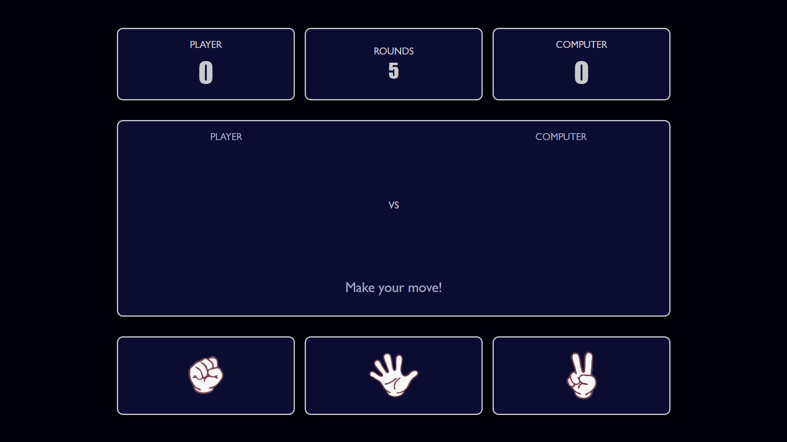

# Rock Paper Scissors

A clean, interactive implementation of the classic **Rock Paper Scissors** game built with **HTML**, **CSS**, and **JavaScript**.  
Designed for simplicity, responsiveness, and a modern dark-themed aesthetic, this project emphasizes modular logic, real-time UI updates, and smooth gameplay.

## Demo

### Screenshot



### Live Priview

[GitHub Pages](https://Dhee-codes.github.io/rock-paper-scissors)

## Features

- **Five-Round Gameplay** – Play 5 rounds against the computer with live score tracking.  
- **Smart Game Logic** – Computer moves are randomly generated for fair play.  
- **Dynamic Visuals** – Displays player and computer choices as images with live results.  
- **Seamless Reset** – "Play Again" resets scores, visuals, and session state cleanly.  
- **Custom Styling** – Modern dark theme implemented purely with CSS; no frameworks needed.  
- **Responsive Layout** – Works on desktop and mobile devices using Flexbox and Grid.

## Tech Stack

- HTML5
- CSS
- Vanilla JavaScript

## Folder Structure

```
rock-paper-scissors/
│
├── images/
│   ├── Rock.png
│   ├── Paper.png
│   └── Scissors.png
│
├── scripts/
│   └── scripts.js
│
├── styles/
│   └── style.css
│
├── .gitignore
├── index.html
├── LICENSE
└── README.md
```

## How It Works

1. The player selects **Rock**, **Paper**, or **Scissors**.  
2. The computer randomly generates its own choice.  
3. The app compares both choices:
   - Rock beats Scissors  
   - Paper beats Rock  
   - Scissors beat Paper  
4. The scoreboard updates after each round.  
5. After 5 rounds, the game session ends and the final result is displayed.  
6. Clicking **Play Again** resets the session for a new game.

## Gameplay & UI

1. **Start a Round:**  
   Click on one of the three choice buttons — Rock, Paper, or Scissors.  

2. **View Results:**  
   - Both the player’s and computer’s choices are displayed as images.  
   - The round result (“You Win!”, “You Lose!”, or “It's a tie!”) appears below the images.  
   - Scores for both player and computer update automatically after each round.  

3. **Rounds:**  
   - Each game session consists of 5 rounds.  
   - After the final round, the game session disappears and the end-game screen appears, showing the final result.  

4. **Play Again:**  
   - Click the **Play Again!** button to reset scores, clear choice images, and restart the game session.  

## Setup & Running Locally

```bash
# Clone the repository
git clone https://github.com/<your-username>/rock-paper-scissors.git

# Navigate into the project folder
cd rock-paper-scissors

# Open in your browser
open index.html
```

Or simply drag & drop the index.html file into any modern browser to play.

## Author

***Dhee-codes***

### Acknowledgement

The Odin Project

## License

This project is licensed under the MIT License.
